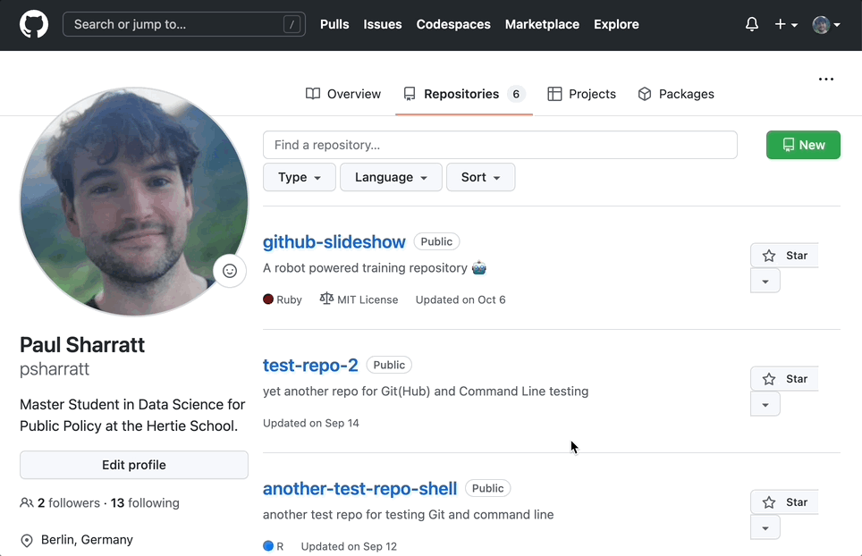
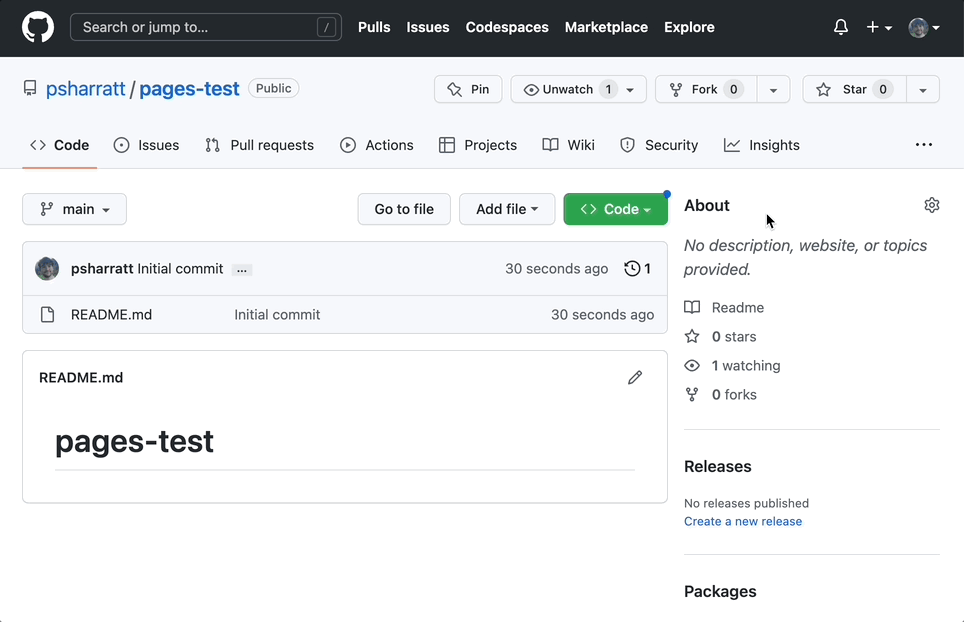
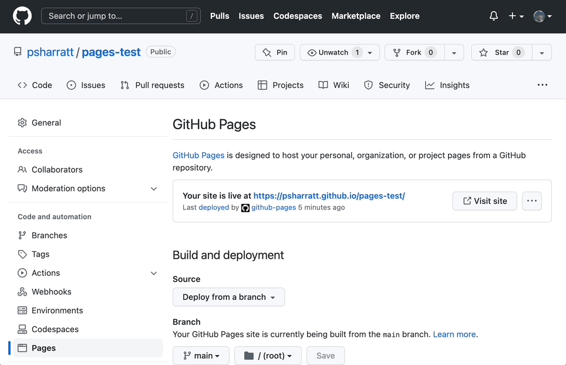
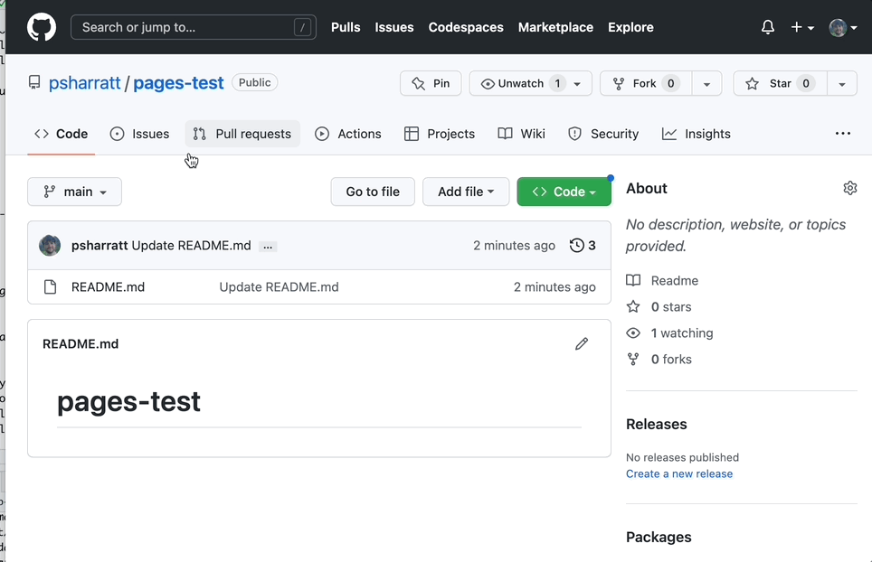
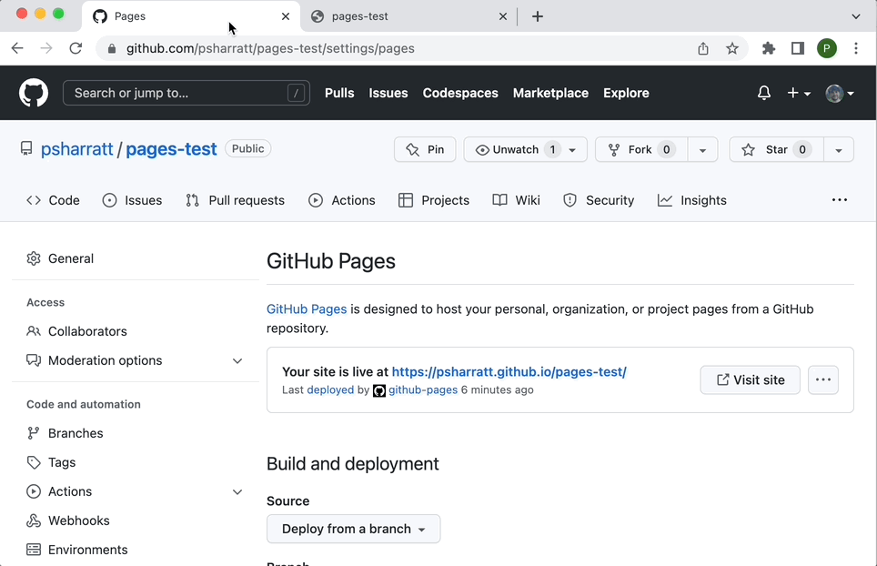
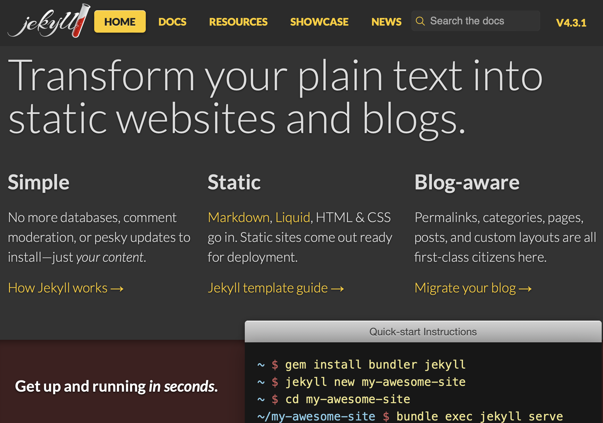

```{r setup, include=FALSE}
# figures formatting setup
options(htmltools.dir.version = FALSE)
library(knitr)
opts_chunk$set(
  comment = "  ",
  prompt = T,
  fig.align="center", #fig.width=6, fig.height=4.5, 
  # out.width="748px", #out.length="520.75px",
  dpi=300, #fig.path='Figs/',
  cache=F, #echo=F, warning=F, message=F
  engine.opts = list(bash = "-l")
  )
## Next hook based on this SO answer: https://stackoverflow.com/a/39025054
knit_hooks$set(
  prompt = function(before, options, envir) {
    options(
      prompt = if (options$engine %in% c('sh','bash')) '$ ' else 'R> ',
      continue = if (options$engine %in% c('sh','bash')) '$ ' else '+ '
      )
})

options(htmltools.dir.version = FALSE)
knitr::opts_chunk$set(echo = FALSE)

library(httr)
```

# Agenda:

<br>

##1. [What is GitHub Pages?](#whatispages)##

##2. [Why would you use GitHub Pages?](#whywouldyouuse)##

##3. [How do you setup GitHub Pages?](#howdoyouuse)##

##4. [What's Jekyll and how do you use it?](#whatsjekyll)##

##5. [Summary](#summary)##

##6. [Further Links and Resources](#linksandresources)##

<br>


---

name:whatispages

#What is GitHub Pages?
.pull-left[

### It's pretty straightforward...

- GitHub Pages is GitHub's webpages hosting service. With Github Pages, you can quickly and easily create public webpages from repos hosted and published through GitHub.
 
- All you need to do is upload your files to a repository, head into Settings to turn on GitHub Pages and its live and hosting your content. 
<br>

- GitHub Pages are public webpages hosted and published through GitHub. The quickest way to get up and running is by using the Jekyll Theme Chooser to load a pre-made theme. You can then modify your GitHub Pages' content and style, but more about that later...

]

.pull-right[
<div align="center">
<br>

</div>

]
```{r, out.height=200 , out.width=400 }
#knitr::include_graphics("./Images/API_gif.gif") COULD PUT IN A GIF HERE...

#useful: https://docs.github.com/en/pages/quickstart
```

---

name: whywouldyouuse

#Why would you use GitHub Pages?

### The Advantages of GitHub Pages
---
# Why would you use GitHub Pages?

### The Advantages of GitHub Pages

.pull-left[

- **Free** - You can host your pages for free and there are no hidden costs.
- **Subdomain** - You get a subdomain (username.github.io) which is provided over HTTPS.<sup>1</sup>
- **Customisible Subdomain** - If you want a more professional and accessible domain, you can create your own domain by adding a CNAME file to the repo or by changing the project's settings.


.footnote[<sup>1</sup> There are [fair usage policies](https://help.github.com/articles/github-terms-of-service/), but it's highly unlikely you'll hit the limits.]

]

--

.pull-right[

- **Open-source** - Unless you change the settings to go private, your repo is open source, making it easier to showcase your code.
- **Real-time Updates** - When you commit an update, GitHub automatically pushes the update out live.
- **Design themes with Jekyll** -You can use a static site generator [Jekyll](https://jekyllrb.com) for your webpage, which means that you can use simple HTML/CSS themes.<sup>2</sup>

.footnote[<sup>2</sup> more about Jekyll in the practice session]
]


---

#One Word of Caution...

##**Warning!**

 - **GitHub Pages are static** and do not support server-side scripting such as, **PHP, Ruby, or Python**.

 - Redirecting URLs is awkward with GitHub Pages.This is important especially when you have an old website that you want to migrate to Hugo; some links may be broken, in which case you can easily redirect them with Netlify.

- One of the best features of Netlify that is not available with GitHub Pages is that Netlify can generate a unique website for preview when a GitHub pull request is submitted to your GitHub repository. This is extremely useful when someone else (or even yourself) proposes changes to your website, since you have a chance to see what the website would look like before you merge the pull request.

---

# How do you setup GitHub Pages?

.pull-left[
<br>
The setup for GitHub Pages is straightforward and we'll cover it in a few simple steps:

**Step 1** - Create a Repo

**Step 2** - Go to `Pages` in the Pepo

**Step 3** - Visit your Page

**Step 4** - Edit Your `README` File

**Step 5** - Clone Your Repo to Add `HTML` & `CSS` files
<br>

]

.pull-right[

<div align="center">

</div>
<div align="center">
<em>You after setting up GitHub Pages for the first time...<em>
</div>
]


---
# How do you setup GitHub Pages?

.pull-left[


**Step 1 - Create a Repo**
- In the upper-right corner of any page, use the  drop-down menu, and select **New repository**.
- Alternatively, click on the big green **New** button.
- Give your repo a name. Your repo's name will form part of your webpage's `URL`
- Add a `README.md` file.
- Click **Create Repository**
- If you already have a repo that you want to create a page for, skip this step.
]

.pull-right[

<div align="center">

</div>

]

---
# How do you setup GitHub Pages?

.pull-left[

**Step 2 - Go to Pages in the repo**
- Under your repository name, click `Settings`
- In the `Code and automation` section of the sidebar, click  **Pages**.
- Under `Build and deployment`, under `Source`, select **Deploy from a branch**.
- Under `Build and deployment`, under `Branch`, use **None** or Branch drop-down menu and select a publishing source.
- In this case, we're using `Main`, but it can be any branch.
- Then click **Save**.
- **Congratulations** - you've created a Page.

]

.pull-right[

<div align="center">

</div>
]

---
# How do you setup GitHub Pages?

.pull-left[

**Step 3 - Vist your Page**
- After a moment, your page will be generated and the URL will show up on the `Pages` section.
- The domain name will be `username.github.io`
- Your webpage will have no content, except for the repo name.
- There are a few ways to add content..
]

.pull-right[

<div align="center">

</div>
]

---
# How do you setup GitHub Pages? 

.pull-left[

**Step 4 - Edit Your `README` File**
- The simplest way to add content to your page is to edit your `README.md` file
- Go to the file in your repo
- Click **Edit** 
- Make the changes in the file.
- Commit the changes 
- After ten minutes, they will be displayed on your webpage.

]

.pull-right[

<div align="center">
<br>

</div>
]

---

# How do you setup GitHub Pages? 

.pull-left[

**Step 5 - Clone Your Repo to Add `HTML` & `CSS` files**
- For more advanced changes, it's best to clone your repo and make changes locally.
- GitHub Pages will automatically incorporate your HTML and CSS files into your webpage.
- Any changes made in the files in your repo will be automatically updated after you commit.

]

.pull-right[

<div align="center">
<br>

</div>
]

---
name:whatsjekyll

#What's Jekyll and how do you use it?

.pull-left[
- Jekyll is a static site generator written in Ruby by Tom Preston-Werner. It is distributed under the open source MIT license.

- Jekyll started a web development trend towards static websites. As of 2017 Jekyll was ranked the most popular static site generator, largely due to its adoption by GitHub. 

- Jekyll provides design templates for static webpages. These can be installed by integrating your GitHub Page with Jekyll.

]

.pull-right[

<div align="center">
<br>

</div>

]

---

name:whatsjekyll

#What's Jekyll and how do you use it? 

.pull-left[
- However, Jekyll is difficult to install as it requires Ruby programming language and that's outside of the scope of this presentation. 

- Essentially, Jekyll allows you to use design templates for your static Pages. This can save you a lot of time writing HTML and CSS, but for today we'll stick to the basic GitHub Pages setup.  
 
- If you want to learn more, there are links at the end of this presentation.  
]

.pull-right[

<div align="center">
<br>

</div>

]

---
name: summary

#Summary

* GitHub Pages is a free hosting service for GitHib repositories.

* Setting up a GitHub Page is super quick and can be done in few simple steps.

* Any changes you make in the repo will be published on the webpage.

* **Warning:** The webpages are static.

* You can use **Jekyll** for web design templates to improve the look of your webpage.


---
name:linksandresources

#Further Links and Resources 

Want to learn more about GitHub Pages? Check out these resources:

### [GitHub Pages Homepage](https://pages.github.com) (Not static!)

### [GitHub Pages - Documentation](https://docs.github.com/en/pages/getting-started-with-github-pages/creating-a-github-pages-site)

###[GitHub Pages and Jekyll - Documentation](https://docs.github.com/en/pages/setting-up-a-github-pages-site-with-jekyll/about-github-pages-and-jekyll)

### [Workshop Repo](https://github.com/intro-to-data-science-22-workshop/21-publishing-sites-with-github-pages-sharratt-lozada)

---

# <center>Thanks for listening!

<br>

### Now for the practice session... 

